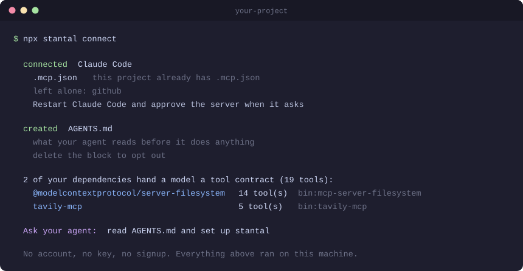
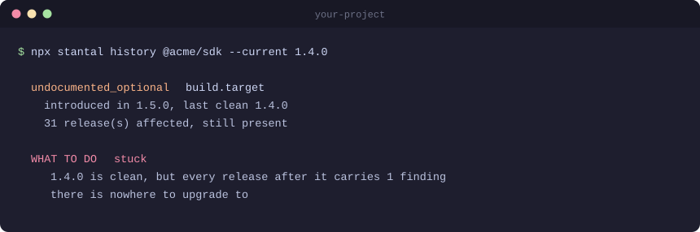

<h1 align="center">Stantal</h1>

<p align="center">
  <b>Self-maintaining dependencies for AI agents.</b><br/>
  Contract testing for the dependencies your AI calls. When the caller is a
  model, the docs <i>are</i> the contract, and a deleted sentence is a breaking
  change with no version number.<br/>
  Stantal finds it, proves it, and puts it back.
</p>

<p align="center">
  <a href="https://github.com/hellunleash/stantal/actions/workflows/ci.yml"></a>
  <a href="https://www.npmjs.com/package/stantal"></a>
  
  
</p>

<p align="center">
  
</p>

---

## What it is

Your agent calls a tool. Everything it knows about that tool is a name, a
description and a list of parameters: plain text, shipped inside one of your
dependencies.

That text is the contract. A patch release rewrites one sentence of it and the
model starts calling the tool wrong. Nothing errors, nothing changes type, no
test fails, and the version number still says patch.

Stantal reads that text out of every version of a package, diffs it, and tells
you what a model would now read differently. It does three things, in order.

1. Finds it: which release changed it, and whether it reaches your code.
2. Proves it: a test in your repo that passes today and fails the day it moves.
3. Puts it back: when no released version is clean, it restores the deleted
   sentence into the copy you actually run, so you are not waiting on the
   provider.

## Why this is new

An API contract used to be the part a compiler could check: names, types,
shapes. Documentation sat beside the contract. You could rewrite every word of
it in a patch release and break nobody.

That is over. When the caller is a model, the documentation is the dispatch
logic. The model picks the tool from its description, and fills a parameter from
its description. Delete the sentence that explains a parameter and the call goes
wrong on a green build, under a patch version number.

Half of this already has a name: schema drift, meaning a renamed field or a new
required parameter. Stantal reports that too, and it is the easy half, because
something somewhere eventually throws. The half nothing checks is the prose, and
that is where the damage is:

> 22 popular packages. 487 releases. 168 changes a model would read
> differently, and 145 of them had no structural signal at all. There was
> nothing to type-check, nothing to fail, and nothing in the changelog.

The case that started this: a package dropped the one sentence saying when to
pass an optional parameter. Everything else about that parameter stayed: the
name, the type, its siblings' guidance. The model filled it in anyway, every
time. 37 tool calls, 37 validation errors, nothing created. The explanation
still exists, in a code comment directly above the line that depends on it. It
just never reaches the model. That was 53 releases ago and it is still there
today.

What makes this kind of break invisible also makes it repairable. Nobody can
safely edit a stranger's schema under their runtime. A sentence is different,
because no caller branches on a description. Only a model reads it. So `stantal
patch` puts the sentence back into your installed copy and the tool works again,
on a version the provider never fixed. Prose only, never a schema or a required
field, and it refuses unless it finds the text exactly once.

---

## Start here

**Paste this into Claude Code, Cursor or Codex:**

> Set up stantal in this repo. Run `npx stantal connect`, then read the
> "Contract drift" section of the AGENTS.md it writes and follow it.
> It needs no account and no API key.

That is the whole setup. `connect` registers the MCP server and writes an
`AGENTS.md` section, which is a short decision procedure rather than a script.
Your agent makes one call, then asks you about what that call actually found:
which packages to protect, which upgrade to hold, which of your files a change
reaches. In a repo with nothing to report it says so and stops.

The file stays in your repository, so the next person to clone it is briefed
without installing anything. Delete the block to opt out.

Prefer a terminal? There are no arguments and no setup:

```bash
npx stantal
```

Run that in any repository. It finds which of your dependencies hand a model
tools, checks the upgrade waiting for each one, works out which of your own files
it reaches, and prints a short list of what to do in order. It reads and ranks;
it writes nothing.

To register it with your coding agent instead, so the agent can ask on its own:

```bash
npx stantal connect
```

```
  connected  Claude Code
    .mcp.json  — this project already has .mcp.json
    left alone: github
    Restart Claude Code and approve the server when it asks

  created  AGENTS.md
    what your agent reads before it does anything — delete the block to opt out

  2 of your dependencies hand a model a tool contract (19 tools):
    @modelcontextprotocol/server-filesystem  14 tool(s)  bin:mcp-server-filesystem
    tavily-mcp                                5 tool(s)  bin:tavily-mcp

  Ask your agent:  read AGENTS.md and set up stantal

  No account, no key, no signup. Everything above ran on this machine.
```

Nothing to install, no config to write, no signup. It reads what you already
have.

---

## The four things you will actually use

### 1. Lock in what your packages do today

```bash
npx stantal pin --all
```

Pinning here is not version pinning. It does not touch your `package.json` and
it does not stop you upgrading. It writes a test file into your repo recording
what each package offers a model right now: which tools exist, which parameters
they take, and which of those are required. The suite passes today and fails the
day an update takes any of it away. There is nothing to maintain, because you own
the files and they keep working whether or not you ever run this tool again.

`--all` does every contract-bearing dependency at once and never overwrites a
suite that already exists. `npx stantal pin @acme/sdk` does one, and re-records
it against whatever is installed now.

### 2. Should I take this update?

```bash
npx stantal @acme/sdk 1.4.0 1.5.0
```

```
  VERDICT  prose-risk
           `target` is optional, has no description, and the tool
           description never says when to pass it.
```

Exit `0` clean · `1` something to look at · `2` could not read enough to say.

It already reports which of your own files a finding touches. Pass `--repo none`
to turn that off, or `--repo <dir>` to point it at a different directory.

### 3. Which release broke it, and where can I go?

```bash
npx stantal history @acme/sdk --current 1.4.0
```



It names the nearest clean release, never just the latest. If none exists it
says so rather than inventing one.

### 4. Put a deleted sentence back

```bash
npx stantal patch @acme/sdk 1.4.0 --apply
```

When no released version is clean, this restores the prose into your installed
copy. Descriptions only, never a schema, a type or a required field. It has to
find the text exactly once or it refuses.

<details>
<summary>Everything else</summary>

```bash
npx stantal watch                       # for a scheduled job: decide what to say
npx stantal check ./ --against 1.4.0    # a release you have not published yet
npx stantal manifest <before> <after>   # a contract that never reached a registry
npx stantal mcp                         # the MCP server itself, over stdio
```

Flags worth knowing: `--surface <subpath>` reads one entry point only ·
`--html <file>` writes the verdict as one shareable page · `--json` prints
everything · `--replay` answers only from recordings and cannot make a network
call · `--repo none` skips reading your own files.

</details>

---

## Using your own model

You do not need one. Everything above runs with no key and no account. That is
the default, and CI checks it on every commit.

A model adds exactly one thing. Some findings are judgement calls: does this
sentence really explain this input? Without a key those are reported as
`unconfirmed` leads. With one, they get confirmed or dropped.

Set any one of these and it is picked up automatically:

```bash
export ANTHROPIC_API_KEY=...
export OPENAI_API_KEY=...
export GEMINI_API_KEY=...
```

Or put one in a `.env` file in your project, which is read automatically.
[`.env.example`](.env.example) lists every option with comments.

| provider | judge | behaviour runner |
|---|---|---|
| anthropic | `claude-opus-5` | `claude-sonnet-5` |
| openai | `gpt-5.4-mini` | `gpt-5.4` |
| gemini | `gemini-3.6-flash` | `gemini-3.6-flash` |

- `STANTAL_JUDGE=none` turns it off even with a key set.
- `STANTAL_JUDGE_MODEL=...` picks a different model.
- `STANTAL_VERTEX_PROJECT=my-project` routes Gemini or Claude through Google
  Cloud instead, so it bills to your cloud account rather than an API key.

What gets sent is one closed question per finding, carrying a tool name, a
parameter name, and that tool's description *as published in the package*. Never
your source, your file names, or anything about your repository.

<details>
<summary>Comparing what a model actually does (opt-in)</summary>

`--behaviour` goes further: it shows a model both versions and compares the tool
calls it makes. Off unless you ask, because it costs several calls per request
per version. Nothing is executed, so there are no credentials and no side
effects, just the call the model would have made.

</details>

---

## In CI

```yaml
name: Contract check
on: pull_request

jobs:
  stantal:
    runs-on: ubuntu-latest
    permissions:
      contents: read
      pull-requests: write
    steps:
      - uses: actions/checkout@v5
      - uses: hellunleash/stantal@v0
        with:
          package: "@acme/sdk"
          from: "1.4.0"
          to: "1.5.0"
```

It posts the verdict as a comment on the pull request and edits that same
comment on every push. No key required.

| input | default | |
|---|---|---|
| `package`, `from`, `to` | — | The dependency and the two versions. |
| `repo` | `.` | Scan your files for what the findings touch. `none` to skip. |
| `fail-on` | `found` | `found`, `unreadable`, or `never`. |
| `comment` | `true` | Post the verdict on the pull request. |
| `emit-tests` | `false` | Also write the pinned tests. |
| `replay` | `false` | Answer only from committed recordings. Cannot spend. |
| `version` | pinned | Which release of the CLI to run. |

Start with `fail-on: unreadable`. On an existing dependency the first run
usually finds real things, and a check that blocks every pull request on day one
gets switched off by Friday.

---

## Let it watch on its own

The check above runs when somebody opens a pull request. Contract drift does not
wait for that. It arrives on release day, in a dependency nobody was thinking
about.

Copy [`templates/stantal-watch.yml`](templates/stantal-watch.yml) into
`.github/workflows/`. Once a week it reads your contracts and, when one moves:

- If a bump is already open, whether from Renovate, Dependabot or a person, it
  comments the verdict on that pull request instead of opening a competing one.
- Otherwise it opens one pull request that adds contract tests recording what
  each package offers today.

It ships the proof, not the fix. The tests it writes pass on your current
versions and fail the moment an upgrade takes any of the contract away, so the
claim is checkable in one command by somebody who has never heard of us. It
never upgrades anything and never touches your source.

It runs with no account and no key. Set `ANTHROPIC_API_KEY`, `OPENAI_API_KEY` or
`GEMINI_API_KEY` as a repository secret and it also puts both contracts in front
of a real model and compares what it does. A scheduled run is the one place
worth paying for, because it happens at most once per release and lands where
someone is deciding.

---

## If you ship an API

Run it against a release you have not published yet:

```bash
npx stantal check ./ --against 1.4.0
```

Nothing has shipped, so there is nothing to defend. You find out which of your
changes will strand customers while it still costs ten minutes to fix.

Already shipped? `npx stantal history <your-package>` gives you the release it
entered, the last one that was safe, and how long anyone on it has had nowhere
to go.

---

## Privacy

- Nothing leaves your machine unless you ask. There is no account and no
  telemetry.
- It never runs the package it reads. Contracts are parsed out of published
  files, so nothing from an untrusted package executes on your machine.
- The scan of your files never calls out. It reads the directory you are in,
  matches findings against it, and stops there, with no network and no upload.
  Turn it off entirely with `--repo none`.
- Private registries already work. Fetching uses `pacote`, which is what npm
  itself uses, so your `.npmrc`, auth token and proxy are handled.
- `--publish` strips your file paths before sending, and prints what it removed.

It also withholds claims it cannot support. Where a package could not be fully
read, the affected findings are listed as withheld rather than reported or
dropped without saying so.

---

## Status

Early development. It runs, it is tested on Linux, Windows and macOS, and the
interface is not stable yet. See [CHANGELOG.md](CHANGELOG.md).

## Development

```bash
npm install
npx tsc --noEmit
npx vitest run
```

---

<p align="center"><sub>MIT</sub></p>
